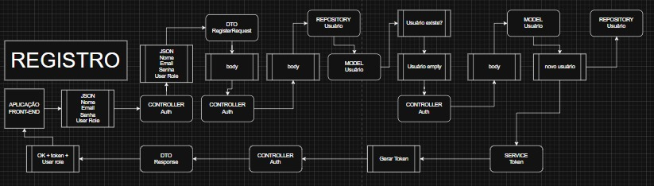
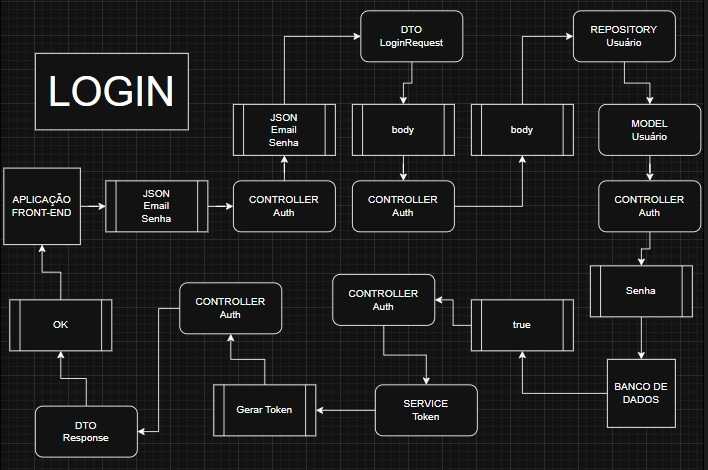

# 🔐 Login Auth API

## Introdução

Login Auth API é uma aplicação Spring Boot que fornece um sistema seguro de **autenticação e registro de usuários usando JWT (JSON Web Token)** e **Spring Security**. A API suporta login, cadastro e controle de acesso baseado em papéis (roles), ideal para integração com aplicações frontend.

## Índice

- [Introdução](#introdução)
- [Instalação](#instalação)
- [Uso](#uso)
- [Funcionalidades](#funcionalidades)
- [Estrutura do Projeto](#estrutura-do-projeto)
- [Fluxogramas](#fluxogramas)
- [Endpoints](#endpoints)
- [Dependências](#dependências)
- [Configuração](#configuração)
- [Exemplos](#exemplos)
- [Solução de Problemas](#solução-de-problemas)
- [Contribuidores](#contribuidores)
- [Licença](#licença)

## Instalação

### Pré-requisitos

- Java 17 ou superior
- Maven
- IDE (como IntelliJ IDEA)
- (Opcional) Postman para testar a API

### Passos

1. Clone o repositório:
   ```bash
   git clone https://github.com/seu-usuario/login-auth-api.git
   cd login-auth-api
   ```

2. Construa o projeto:
   ```bash
   ./mvnw clean install
   ```

3. Execute a aplicação:
   ```bash
   ./mvnw spring-boot:run
   ```

A API estará disponível em `http://localhost:8080`.

## Uso

- Registre um novo usuário com `nome`, `email`, `senha` e `cargo` (role)
- Realize login usando as credenciais cadastradas para receber um **token JWT**
- Utilize o token JWT no header Authorization para acessar endpoints protegidos

## Funcionalidades

- 🔐 Autenticação segura com JWT
- 🧾 Controle de acesso baseado em cargos
- 🛡️ Criptografia de senha com BCrypt
- 📦 Utilização de DTOs para requisições e respostas
- 🧪 Endpoints REST prontos para uso

## Estrutura do Projeto

```
com.example.login_auth_api
├── controllers
│   ├── AuthController.java
│   └── UserController.java
├── domain.user
│   ├── User.java
│   └── UserRole.java
├── dto
│   ├── LoginRequestDTO.java
│   ├── RegisterRequestDTO.java
│   └── AuthResponseDTO.java
├── repository
│   └── UserRepository.java
├── service
│   └── TokenService.java
└── security
    ├── SecurityConfig.java
    └── filters/JwtAuthFilter.java
```

## Fluxogramas

### Registro de Usuário



### Login de Usuário



## Endpoints

| Método | Endpoint         | Descrição                    | Autenticação |
|--------|------------------|------------------------------|--------------|
| POST   | `/auth/register` | Registrar novo usuário       | ❌           |
| POST   | `/auth/login`    | Realizar login e gerar token | ❌           |
| GET    | `/user/profile`  | Obter perfil do usuário      | ✅ JWT       |

## Dependências

- Spring Boot Starter Web
- Spring Security
- Spring Data JPA
- Lombok
- jjwt (Java JWT)
- Banco H2 (para testes)

## Configuração

Ajuste as propriedades em `application.properties`:

```properties
spring.datasource.url=jdbc:h2:mem:testdb
spring.datasource.driverClassName=org.h2.Driver
spring.datasource.username=sa
spring.datasource.password=

jwt.secret=chave_secreta_para_token
jwt.expiration=3600000
```

## Exemplos

### Requisição de Registro

```json
POST /auth/register
{
  "name": "João Silva",
  "email": "joao@example.com",
  "password": "senha123",
  "role": "USER"
}
```

### Requisição de Login

```json
POST /auth/login
{
  "email": "joao@example.com",
  "password": "senha123"
}
```

### Resposta

```json
{
  "token": "eyJhbGciOiJIUzI1NiIsInR5cCI6IkpXVCJ9...",
  "role": "USER"
}
```

## Solução de Problemas

- **Credenciais inválidas?** Verifique se o usuário está cadastrado e se a senha está correta.
- **Token expirado?** Verifique o tempo de validade do JWT ou realize o login novamente.
- **403 Forbidden?** Certifique-se de que o token está sendo enviado no header `Authorization: Bearer <token>`.

## Contribuidores

- [Gabriel Barbosa Magalhães](https://github.com/gabrielbm119)

